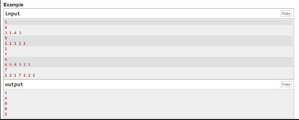
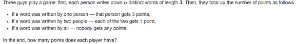
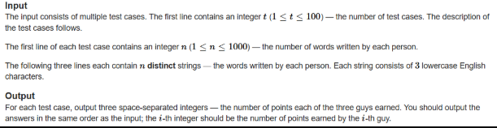

A. Utilize C++ STL if needed. Write a C++ program to solve the following, 

B. Utilize C++ STL if needed. Write a C++ program to solve the following, 

C. Write a separate C++ menu-driven program to implement Priority Queue ADT using a max heap. Maintain proper boundary conditions and follow good coding practices. The Priority Queue ADT has the following operations, 
 
1. Insert 
2. Delete 
3. Display 
4. Search 
5. Sort (Heap Sort)  
6. Exit 

What is the time complexity of each of the operations? (K4) 