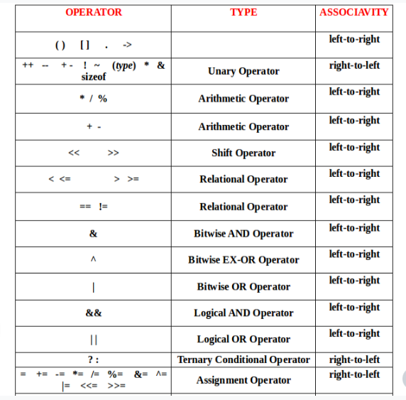

A. Write a separate C++ menu-driven program to implement stack ADT using a character array of size 5. Maintain proper boundary conditions and follow good coding practices. Stack ADT has the following operations, 
 
1. Push 
2. Pop 
3. Peek 
4. Exit 
 
What is the time complexity of each of the operations? (K4)

B. Write a separate C++ menu-driven program to implement stack ADT using a character singly linked list. Maintain proper boundary conditions and follow good coding practices. Stack ADT has the following operations, 
 
1. Push 
2. Pop 
3. Peek 
4. Exit 
 
What is the time complexity of each of the operations? (K4) 
 
C. Write a C++ menu-driven program to implement infix to postfix and postfix evaluation. Use the singly linked list (SLL) to implement the stack ADT as a header file. Maintain proper boundary conditions and follow good coding practices. The program has the following operations, 
 
1. Get Infix 
2. Convert Infix 
3. Evaluate Postfix 
4. Exit 
 
The Get Infix option gets a valid infix expression and stores it efficiently. 
The Convert Infix option converts the stored infix expression into a postfix expression. It prints the postfix expression at the end after conversion. 
The Evaluate Postfix expression calculates and prints the output of the converted infix expression.  

 

Implement for only arithmetic and assignment operators following the precedence and associativity given in the table below, 

 

For the "Assignment" Operators, implement only for "=" operator. 

What is the time complexity of each of the operations? (K4) 
 
D. Write a C++ menu-driven program to get a string of '(' and ')' parenthesis from the user and check whether they are balanced. Identify the optimal ADT and data structure to solve the mentioned problem. You can consider all previous header files for the solution's implementation. Maintain proper boundary conditions and follow good coding practices. The program has the following operations, 
 
1. Check Balance 
2. Exit 
 
The Check Balance operations get a string of open and closed parentheses. Additionally, it displays whether the parenthesis is balanced or not. Explore at least two designs (solutions) before implementing your solution. 

 
What is the time complexity of each solution, and what is the optimal solution? Justify your answer. (K5) 