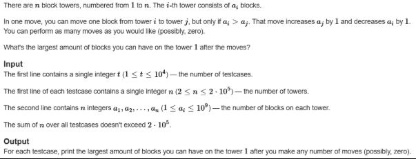
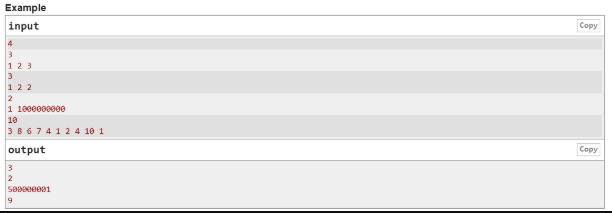
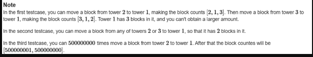

A. Utilize C++ STL to solve the following (K5),  

B. Write a separate C++ menu-driven program to implement Tree ADT using a character binary tree. Maintain proper boundary conditions and follow good coding practices. The Tree ADT has the following operations, 
 
1. Insert 
2. Preorder 
3. Inorder 
4. Postorder 
5. Search 
6. Exit 
 
What is the time complexity of each of the operations? (K4) 