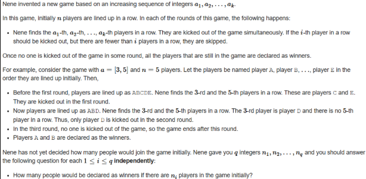
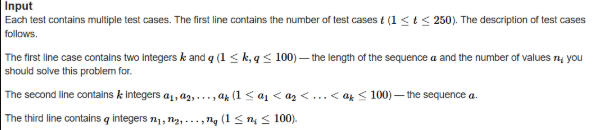
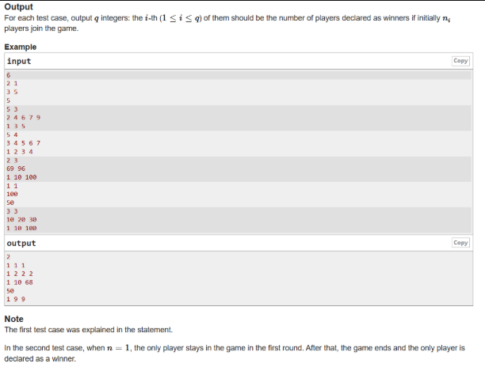
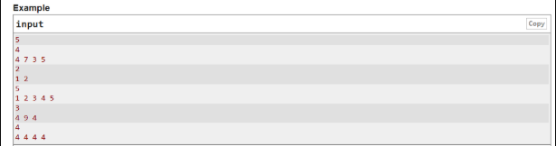
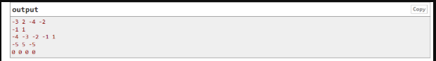

A. Utilize C++ STL to solve the following (K5), 

B. Utilize C++ STL to solve the following (K5),

C. Write a separate C++ menu-driven program to implement Tree ADT using a binary search tree. Maintain proper boundary conditions and follow good coding practices. The Tree ADT has the following operations, 
 
1. Insert 
2. Preorder 
3. Inorder 
4. Postorder 
5. Search 
6. Exit 
 
What is the time complexity of each of the operations? (K4) 

D. Add a "construct expression tree" method to the binary tree data structure from the previous lab code—import stack from the standard template library (STL) to construct the expression tree. Import the Tree ADT program into another program that gets a valid postfix expression, constructs, and prints the expression tree. It consists of the following operations. 
 
1. Postfix Expression 
2. Construct Expression Tree 
3. Preorder 
4. Inorder 
5. Postorder 
6. Exit 